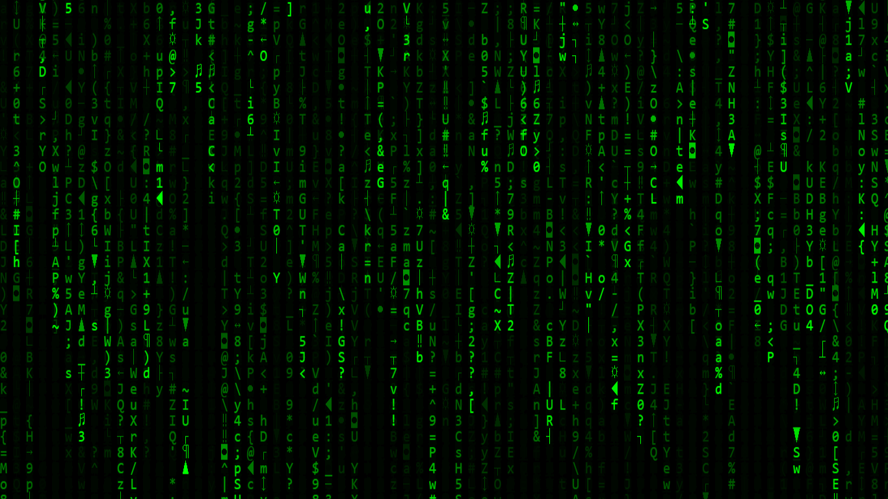

# MATRIX EFFECT

This is a funny project, Matrix Effect

  I DID NOT WRITE THIS CODE FROM SCRATCH

Creddits for the creator: https://dev.to/gnsp/making-the-matrix-effect-in-javascript-din

I only added a very simple "index.css" file where I changed the height and width to the screen. now the matrix effect is Full screen.

Now you can clone this project and run the "index.html" file inside "src/". and you also can expand your navigator, I'm in Chrome for set up full screen I only need to push "Key F11" like that:

